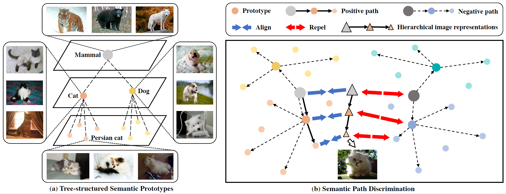

# HIRL: A General Framework for Hierarchical Image Representation Learning

This branch provides all the source code to reproduce two transfer learning experiments 
(**object detection and instance segmentation on COCO**) in the paper [HIRL: A General Framework for Hierarchical Image Representation Learning](https://arxiv.org/pdf/xxx.pdf).

<p align="center">
   
</p>

HIRL is an effective and flexible framework to learn the hierarchical semantic information underlying a large-scale image database. 
It can be flexibly combined with off-the-shelf image SSL approaches and improve them by learning multiple levels of image semantics.
We employ three representative CNN based SSL methods and three representative Vision Transformer based SSL methods as baselines. 
After adapted to the HIRL framework, the effectiveness of all six baseline methods are improved on diverse downstream tasks. 

## Roadmap
- [2022/05/26] The initial release! We release all source code for pre-training and downstream evaluation. We release all pre-trained model weights for (HIRL-)MoCo v2, (HIRL-)SimSiam, (HIRL-)SwAV, (HIRL-)MoCo v3, (HIRL-)DINO and (HIRL-)iBOT.

## TODO
- [ ] Incorporate more baseline image SSL methods in this codebase, e.g., CAE, MAE, BEiT and SimMIM.
- [ ] Adapt more baselines into the HIRL framework, e.g., HIRL-CAE, HIRL-MAE, HIRL-BEiT and HIRL-SimMIM.  
- [ ] Explore other ways to learn hierarchical image representations, except for semantic path discrimination.

## Benchmark and Model Zoo
| Method | Arch. | Epochs | Batch Size | KNN | Linear | Fine-tune | Url | Config |
|---------------|---------|:------:|:------:|:--------:|:--------:|:--------:|-------|---------|
| MoCo v2 | ResNet-50 | 200 | 256 | 55.74 | 67.60 | 73.14 | [model](https://hirlmodels.s3.us-east-2.amazonaws.com/mocov2_200eps_backbone.pth) | [cfg](configs/pretrain/baseline/mocov2_resnet50_200eps.yaml) |
| HIRL-MoCo v2 | ResNet-50 | 200 | 256 | 57.56 | 68.40 | 73.86 | [model](https://hirlmodels.s3.us-east-2.amazonaws.com/hirl_mocov2_200eps_backbone.pth) | [cfg](configs/pretrain/hirl/hirl_mocov2_resnet50_200eps.yaml) |
| SimSiam | ResNet-50 | 200 | 512 | 60.17 | 69.74 | 72.25 | [model](https://hirlmodels.s3.us-east-2.amazonaws.com/simsiam_200eps_backbone.pth) | [cfg](configs/pretrain/baseline/simsiam_resnet50_200eps.yaml) |
| HIRL-SimSiam | ResNet-50 | 200 | 512 | 62.68 | 69.81 | 72.88 | [model](https://hirlmodels.s3.us-east-2.amazonaws.com/hirl_simsiam_200eps_backbone.pth) | [cfg](configs/pretrain/hirl/hirl_simsiam_resnet50_200eps.yaml) |
| SwAV | ResNet-50 | 200 | 4096 | 63.45 | 72.68 | 76.82 | [model](https://hirlmodels.s3.us-east-2.amazonaws.com/swav_200eps_backbone.pth) | [cfg](configs/pretrain/baseline/swav_resnet50_200eps.yaml) |
| HIRL-SwAV | ResNet-50 | 200 | 4096 | 63.99 | 73.43 | 77.18 | [model](https://hirlmodels.s3.us-east-2.amazonaws.com/hirl_swav_200eps_backbone.pth) | [cfg](configs/pretrain/hirl/hirl_swav_resnet50_200eps.yaml) |
| SwAV | ResNet-50 | 800 | 4096 | 64.84 | 73.36 | 77.77 | [model](https://hirlmodels.s3.us-east-2.amazonaws.com/swav_800eps_backbone.pth) | [cfg](configs/pretrain/baseline/swav_resnet50_800eps.yaml) |
| HIRL-SwAV | ResNet-50 | 800 | 4096 | 65.43 | 74.80 | 78.05 | [model](https://hirlmodels.s3.us-east-2.amazonaws.com/hirl_swav_800eps_backbone.pth) | [cfg](configs/pretrain/hirl/hirl_swav_resnet50_800eps.yaml) |
| MoCo v3 | ViT-B/16 | 400 | 4096 | 71.29 | 76.44 | 81.94 | [model](https://hirlmodels.s3.us-east-2.amazonaws.com/mocov3_400eps_backbone.pth) | [cfg](configs/pretrain/baseline/mocov3_vit_base_400eps.yaml) |
| HIRL-MoCo v3 | ViT-B/16 | 400 | 4096 | 71.68 | 75.12 | 82.19 | [model](https://hirlmodels.s3.us-east-2.amazonaws.com/hirl_mocov3_400eps_backbone.pth) | [cfg](configs/pretrain/hirl/hirl_mocov3_vit_base_400eps.yaml) |
| DINO | ViT-B/16 | 400 | 1024 | 76.01 | 78.07 | 82.09 | [model](https://hirlmodels.s3.us-east-2.amazonaws.com/dino_400eps_backbone.pth) | [cfg](configs/pretrain/baseline/dino_vit_base_400eps.yaml) |
| HIRL-DINO | ViT-B/16 | 400 | 1024 | 76.84 | 78.32 | 83.24 | [model](https://hirlmodels.s3.us-east-2.amazonaws.com/hirl_dino_400eps_backbone.pth) | [cfg](configs/pretrain/hirl/hirl_dino_vit_base_400eps.yaml) |
| iBOT | ViT-B/16 | 400 | 1024 | 76.64 | 79.00 | 82.47 | [model](https://hirlmodels.s3.us-east-2.amazonaws.com/ibot_400eps_backbone.pth) | [cfg](configs/pretrain/baseline/ibot_vit_base_400eps.yaml) |
| HIRL-iBOT | ViT-B/16 | 400 | 1024 | 77.49 | 79.36 | 83.37 | [model](https://hirlmodels.s3.us-east-2.amazonaws.com/hirl_ibot_400eps_backbone.pth) | [cfg](configs/pretrain/hirl/hirl_ibot_vit_base_400eps.yaml) |


## Installation
This repository is officially tested with the following environments:
- Linux
- Python 3.6+
- PyTorch 1.10.0
- CUDA 11.3

The environment could be prepared in the following steps:
1. Create a virtual environment with conda:
```
conda create -n hirl-det-seg python=3.7.3 -y
conda activate hirl-det-seg
```
2. Install PyTorch with the [official instructions](https://pytorch.org/). For example:
```
conda install pytorch==1.10.0 torchvision==0.11.0 torchaudio==0.10.0 cudatoolkit=11.3 -c pytorch -c conda-forge
```
3. Install dependencies:
```
## install other dependencies
pip install -r requirements.txt
```
4. Install `detectron2` for CNN object detection & instance segmentation downstream evaluation:
```
## install detectron2
pip install detectron2 -f \
  https://dl.fbaipublicfiles.com/detectron2/wheels/cu113/torch1.10/index.html
```
5. Install `mmdetection` for ViT object detection & instance segmentation downstream evaluation:
```
## install mmcv
pip install mmcv-full -f https://download.openmmlab.com/mmcv/dist/{cu113}/{torch1.10.0}/index.html
## install mmdet
pip install mmdet
```

## Usage

### Prepare COCO Dataset

COCO is employed for object detection and instance segmentation experiments. 
Download train/val2017 splits from the [official website](https://cocodataset.org/#download). We recommend 
symlink the dataset folder to `./datasets/coco/`. The folder structure is expected to be:
```
datasets/
  coco/
    annotations/
      instances_train2017.json
      instances_val2017.json
      ...
    train2017/
    val2017/
```

## Evaluation

### CNN based Object Detection & Instance Segmentation

For CNN based methods, we use `detectron2` for downstream evaluation on COCO dataset, 
where detection and segmentation are jointly performed by task-specific heads following *Mask R-CNN*. 

To evaluate the baseline MoCo v2, SimSiam and SwAV models, you can use the following command:
```
python3 launch.py --dist 0 --launch ./eval_resnet/detection/launch.py \
--backbone_prefix backbone --pretrained [pretrained model file in .pth] \
--output_dir [your experiment dir]
```

To evaluate the HIRL-MoCo v2, HIRL-SimSiam and HIRL-SwAV models, you can use the following command:
```
python3 launch.py --dist 0 --launch ./eval_resnet/detection/launch.py \
--backbone_prefix model.backbone --pretrained [pretrained model file in .pth] \
--output_dir [your experiment dir]
```

*Note*: please use absolute path for `--pretrained`.

### ViT based Object Detection & Instance Segmentation
For ViT based methods, we use `mmdetection` for downstream evaluation on COCO dataset, 
where detection and segmentation are jointly performed by task-specific heads following *Mask R-CNN*. 

To evaluate the baseline MoCo v3, DINO and iBOT models, you can use the following command:
```
python3 launch.py --dist 0 --launch ./eval_vit/object_detection/launch.py \
--backbone_prefix backbone --pretrained [pretrained model file in .pth] \
--output_dir [your experiment dir] 
```

To evaluate the HIRL-MoCo v3, HIRL-DINO and HIRL-iBOT models, you can use the following command:
```
python3 launch.py --dist 0 --launch ./eval_vit/object_detection/launch.py \
----backbone_prefix model.backbone --pretrained [pretrained model file in .pth] \
--output_dir [your experiment dir] 
```

*Note*: please use absolute path for `--pretrained`.

## License
This repository is released under the MIT license as in the [LICENSE](LICENSE) file.

## Citation

If you find this repository useful in your research, please cite the following paper:
```
@article{xu2022hirl,
  title={HIRL: A General Framework for Hierarchical Image Representation Learning},
  author={Xu, Minghao and Guo, Yuanfan and Zhu, Xuanyu and Li, Jiawen and Sun, Zhenbang and Tang, Jian and Xu, Yi and Ni, Bingbing},
  journal={arXiv preprint arXiv:2205.xxx},
  year={2022}
}
```

## Acknowledgements
The baseline methods in this codebase are based on the following open-resource projects. We would like to thank the authors for releasing the source code.
- [MoCo](https://github.com/facebookresearch/moco)
- [SimSiam](https://github.com/facebookresearch/simsiam)
- [SwAV](https://github.com/facebookresearch/swav)
- [MoCo V3](https://github.com/facebookresearch/moco-v3)
- [DINO](https://github.com/facebookresearch/dino)
- [iBOT](https://github.com/bytedance/ibot)